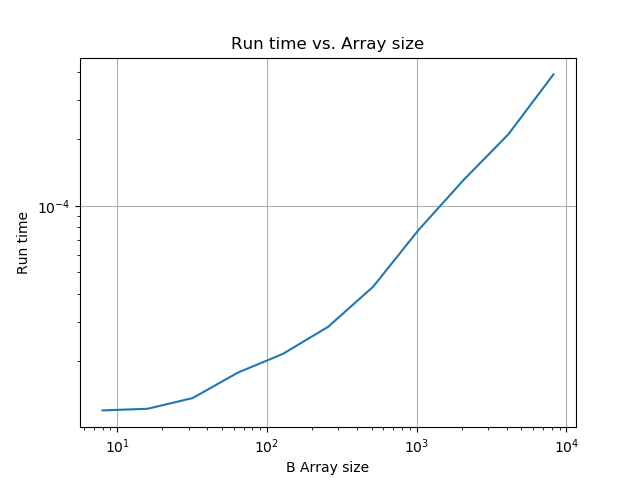

# Homework 10: Vector Addition

Group 4: 
- Abhinav Kumar
- Avrajit Ghosh
- Siddhant Gautam
- Trevor Fush

### Vector Addition

Let’s use our newly found skills in MPI collectives to make some calculations. We are going to do the addition of 2 arrays, that is

`result[indx] = a[indx] + b[indx]`

for all the elements of the two arrays `a` and `b`. Note, if one of the arrays is longer, assume that the shorter is filled with 0’s from its end index to the size of the longer array. The result should be an array the size of the longest of a and/or b

#### Outline
Write a program that does the following:

- take in a command line argument which is the size of the arrays (they will be the same size this way).
- have the primary node create the two arrays and fill them with random numbers.
- distribute parts of the arrays to the various worker nodes where they will do their own local addition
- collect the results from the worker nodes to make the final `result` array
- have the primary node print out the summed `result` array.

If you want to make the workers work harder (to get better roofline type performance) you could add the result of some calculation using the a and b elements (square root, raise it to a fractional power, atan, something that takes time), for example: `result[i] = atan(sqrt(a[i])) + atan(sqrt(b[i]))`. Just to keep it busy.

Modify the above so that one of the arrays is longer than the other (add a few to the provided CLI argument) and show that your code works that way as well.

#### Runs and Plots

- Try it on the HPC, making each process run on a different node. 
- Try various array sizes to increase communication overhead and graph the result. 
- Does arbitrarily making the nodes do calculations (as described) significantly increase the arithmetic intensity?

### Requirements
1. mpic++
2. python 3.6

### Compilation and Running
Navigate to the current directory and then run
```bash
chmod +x main.sh
./main.sh | tee output/output.log

```


### Results 
Results are in [output.log](output/output.log)

### Discussions
1. **Plot of various array sizes vs timing**



2. **Does arbitrarily making the nodes do calculations (as described) significantly increase the arithmetic intensity?**

Yes, it increases the arithmetic complexity


