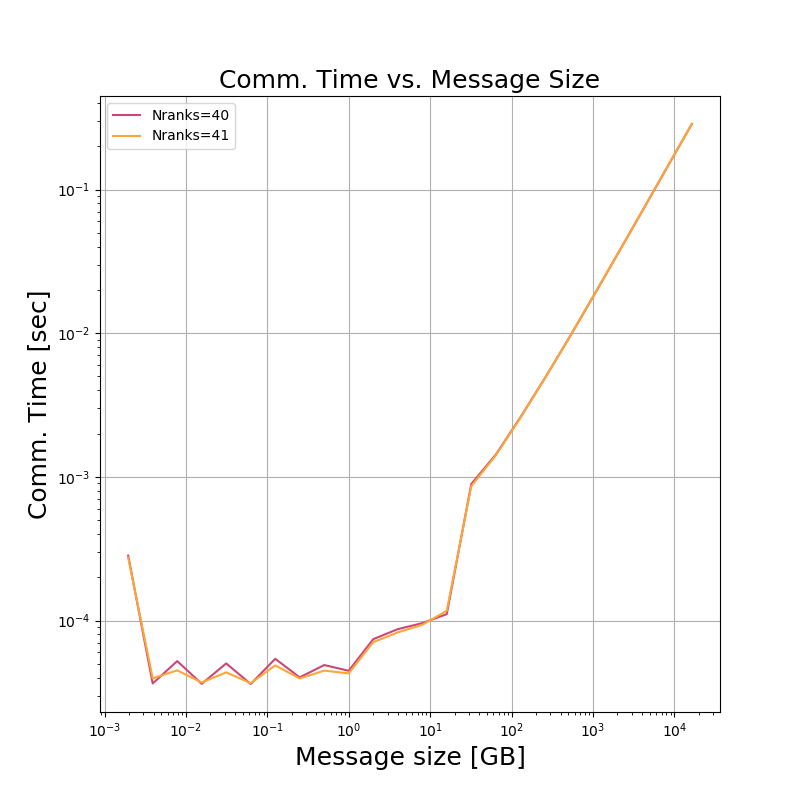

# Homework 8: MPI Ping Pong

Group 4: 
- Abhinav Kumar
- Avrajit Ghosh
- Siddhant Gautam
- Trevor Fush

### MPI Ping Pong

In this homework, you will study the parallel performance of simple code that passes messages of varied size between different MPI ranks. You may find it useful to refer to the LLNL MPI tutorial: https://computing.llnl.gov/tutorials/mpi/.

In the readings you have seen a simple “ping-pong” communication between two ranks using blocking sends and receives. In the ping-pong, process i sends a message of size m to process j, then receives a message of size m back from j. The values of i, j, and m to use are given below.

In your groups, write a simple MPI program implementing the ping-pong communication pattern.
Measure the performance of the ping pong using the following test cases where nranks is the number of processes in MPI_COMM_WORLD. Make sure that you run on at least two nodes; the easiest way to do that is to place only one process per node.

- `nranks=40`, `i=0`, `j=nranks-1`; `m=2^k` bytes where `k` is an increasing integer array from 0 to 24. Other processes in MPI_COMM_WORLD are idle
- `nranks=41`, `i=0`, `j=nranks-1`; `m=2^k` bytes where `k` is an increasing integer array from 0 to 24. Other processes in MPI_COMM_WORLD are idle

Use non-interactive jobs submitted to the batch queue using SLURM. When you measure time for these operations, ensure that you (a) measure a long enough time to be significant (use MPI_Wtime) and (b) make 100 separate measurements for each test. Report the average time taken for the measurements.

Plot the time for communication of a single exchange (send and receive) as a function of message size for the two cases. Using this plot, estimate the latency and bandwidth for each case. Are they different? Explain your results.


### Requirements
1. OpenMPI
2. python 3.6

### Compilation and Running
Navigate to the current directory and then run
```bash
sbatch run_mpi.sb
```


### Results 
Results are in `case1.csv` and `case2.csv`.

### Discussions
1. **Plot the time for communication of a single exchange (send and receive) as a function of message size for the two cases. Using this plot, estimate th elatency and bandwidth for each case. Are they different? Explain your results.**  



From the plot above, it appears that the latency and bandwidth between the runs with `nranks=40` and `nranks=41` are the same, which would make sense because adding one more node to the original 40 nodes would not stress the network much more. For the values of the latency and bandwidth, it appears that the latency is around 2.5e-5 seconds (where the plot is flat as the message size increases), and the bandwidth is around 10 Gb/s. 
